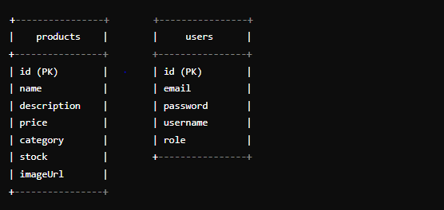

# LUMINOUS FOOTWEAR

## Deskripsi
Aplikasi penjualan sepatu berbasis web yang memungkinkan pelanggan untuk melihat, dan mengelola produk sepatu. Admin bertanggung jawab untuk mengelola produk, termasuk menambah, mengedit, dan menghapus produk yang tersedia. Sistem mendukung autentikasi pengguna dengan dua jenis peran: pelanggan dan admin.

## Fitur-fitur
- **Autentikasi Pengguna**: admin memiliki akses untuk mengelola produk.
- **Manajemen Produk**: Admin dapat menambah, mengedit, dan menghapus produk sepatu.
- **Katalog Produk**: Menampilkan daftar sepatu 
- **Katalog Produk**: Bisa Menseacrh nya sesuai abzad

###  ERD

## Tech Stack
- **Bahasa Pemrograman**: 
  - **Frontend**: JavaScript (React.js)
  - **Backend**: Java (Spring Boot)

- **Framework/Libraries**: 
  - **Frontend**:
    - React.js
    - Axios:
  - **Backend**:
    - Spring Boot
    - Spring Security
    
- **Database**:
  - MySQL: Penyimpanan data produk, pengguna.

- **Tools Lainnya**:
  - Git: Manajemen kode dan kolaborasi.

